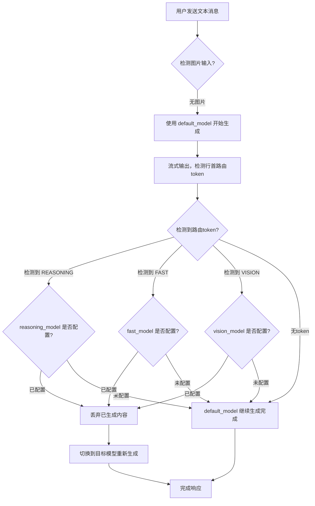
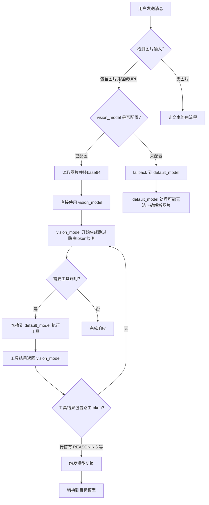
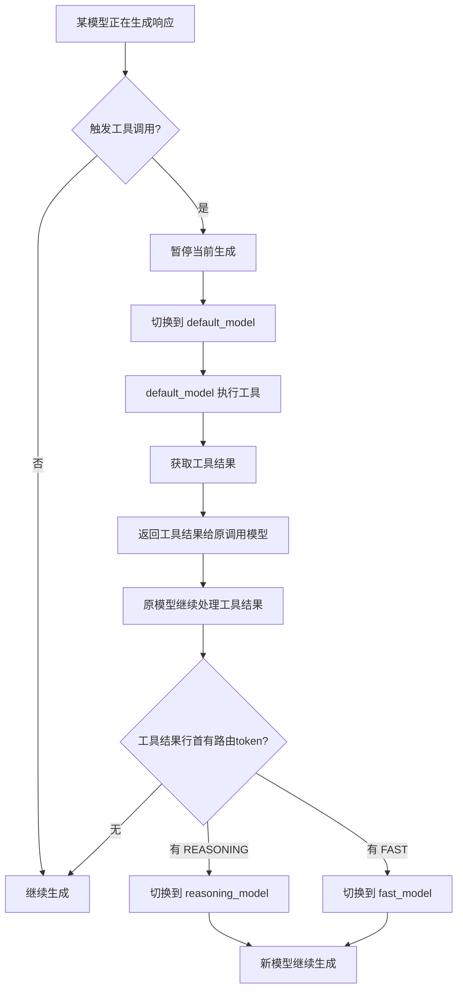
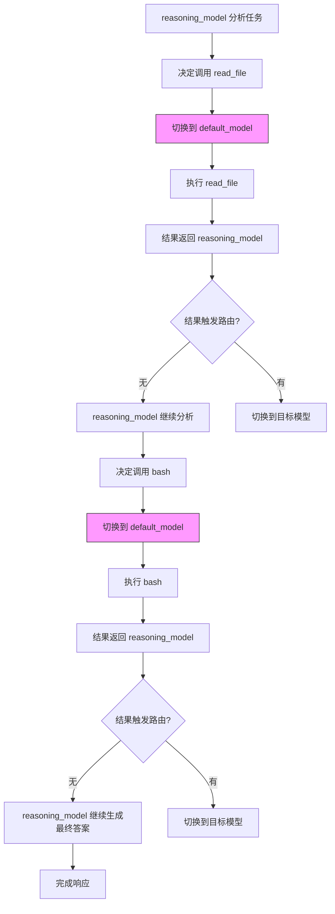
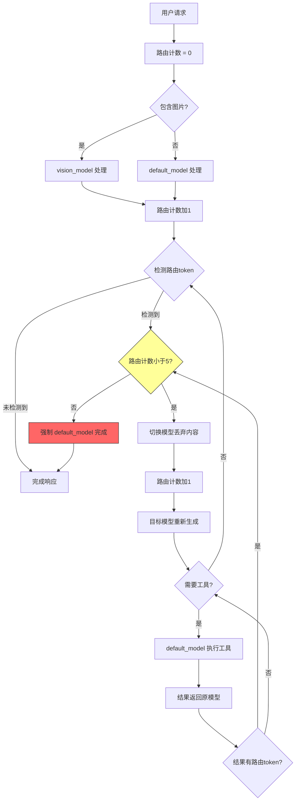
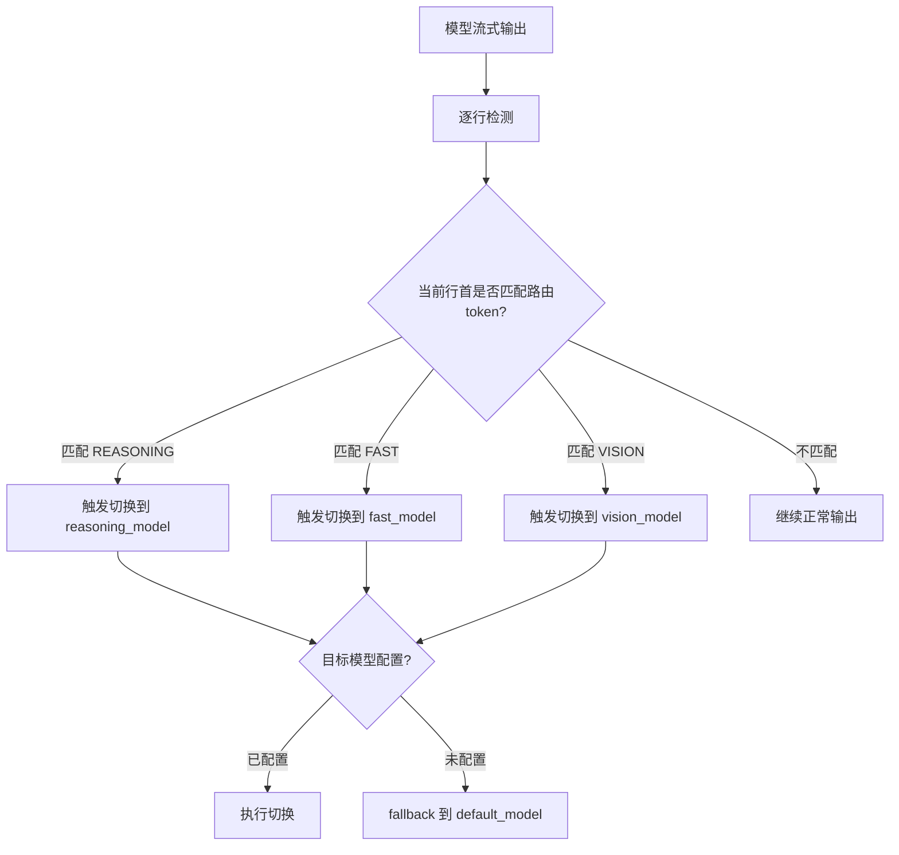

# Multi-Model Routing Flow Diagrams

> **SUPERSEDED BY spec 010**: This document describes the route-token design, which was replaced by subagent tools. See `specs/010-single-model-routing-fix/` for the current design.

**Feature**: 009-multi-model-routing
**Created**: 2026-04-16

---

## 1. Basic Text Request Routing

**Flow Description**:
1. System detects no image input in user message
2. Starts generation with `default_model`
3. Monitors streaming output for route tokens at line start
4. If route token detected:
   - If target model configured: discard content, switch to target model, regenerate
   - If target model not configured: fallback to `default_model`, continue
5. If no route token: `default_model` completes response

---

## 2. Image Input Routing

**Flow Description**:
1. System detects image input (local path or URL) before request
2. If `vision_model` configured: read image, route directly to `vision_model`
3. If `vision_model` not configured: fallback to `default_model` (may have limited image capability)
4. `vision_model` generates response, skips initial route token detection
5. Tool calls during generation: switch to `default_model` for execution
6. Tool results returned to `vision_model` for continued processing
7. Route tokens in tool results can trigger model switching

---

## 3. Tool Call Model Switching

**Flow Description**:
1. Any model (reasoning/default/fast/vision) generating response
2. When tool call triggered: pause generation, switch to `default_model`
3. `default_model` executes tool, obtains result
4. Tool result returned to original calling model
5. Calling model continues processing tool result
6. If tool result contains route token at line start: trigger model switch
7. If no route token: calling model continues generation

---

## 4. Multiple Sequential Tool Calls

**Flow Description**:
1. `reasoning_model` analyzes complex task
2. Decides to call `read_file` tool
3. Switch to `default_model` for tool execution
4. Result returned to `reasoning_model`
5. `reasoning_model` continues, decides to call `bash` tool
6. Switch to `default_model` again (independent call)
7. Result returned to `reasoning_model`
8. Each tool call is independent - separate `default_model` invocation
9. Final response generated by `reasoning_model`

---

## 5. Complete Routing Lifecycle with Safety Limit

**Flow Description**:
1. Initialize route count to 0
2. Check for image input: if present, route to `vision_model`; otherwise `default_model`
3. Increment route count
4. Monitor for route tokens during streaming
5. If route token detected:
   - If route count < 5: switch model, discard content, increment count
   - If route count >= 5: force `default_model` to complete (safety limit)
6. If tool call needed: `default_model` executes, result returns to calling model
7. Tool results checked for route tokens
8. Cycle continues until completion or safety limit reached

**Safety Mechanism**:
- Maximum 5 route switches per request
- Prevents infinite loops from repeated route token outputs
- After limit: `default_model` forced to complete regardless of detected tokens

---

## 6. Route Token Detection Rules

**Detection Rules**:
- **Line Start Only**: Route tokens must appear at the beginning of a line
- **Exact Match**: `REASONING`, `FAST`, `VISION` tokens (case-sensitive)
- **No Prefix**: Spaces or other characters before token invalidate detection
- **Tool Results**: Same rules apply to tool execution output
- **User Input**: Route tokens in user messages are treated as normal content (not routing triggers)

---

## 7. Route Token Examples

| Output Content | Token Position | Result |
|----------------|----------------|--------|
| `[REASONING] 分析如下...` | Line start | Triggers switch to reasoning_model |
| `这是一些思考 [REASONING]...` | Not line start | No switch triggered |
| `  [FAST] 快速回答` | Has space prefix | No switch triggered |
| `[VISION]\n描述图片...` | Line start | Triggers switch to vision_model |

---

## 8. Model Selection Decision Matrix

| Input Type | Initial Model | Route Token Detection | Fallback Chain |
|------------|---------------|----------------------|----------------|
| Text only | `default_model` | Yes (line start) | configured model → `default_model` |
| Image (path/URL) | `vision_model` | No (bypass) | `default_model` |
| Tool call | `default_model` | Yes (in results) | calling model continues |
| After route token | Target model | Yes (continue monitoring) | `default_model` if target unset |
| Safety limit hit | `default_model` | No (forced completion) | None |

---

## Key Implementation Points

1. **RoutingRunLoop**: Enhanced execution loop that wraps model generation with route monitoring
2. **ModelRouter**: Analyzes request content (images, route tokens) and selects target model
3. **ToolExecutor**: Independent module using `default_model` for all tool executions
4. **Route Count**: Global counter per request to enforce 5-switch limit
5. **Streaming Detection**: Real-time line-by-line analysis during model output
6. **Context Preservation**: Calling model identity preserved through tool execution for result return